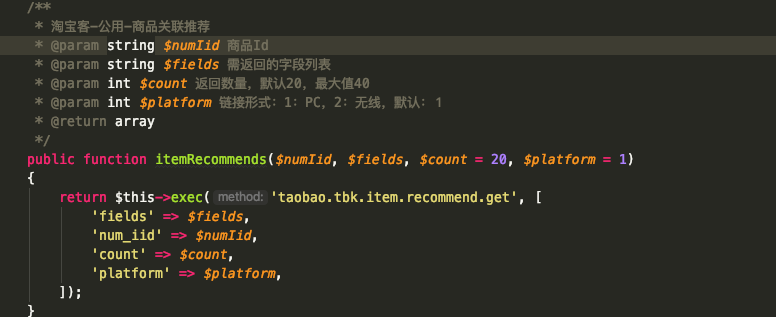

# open-taobao 
淘宝开放平台sdk (含淘宝客API)，支持 laravel。

* API 齐全
* 丰富合理的注释
* 完善的参数提示
* 支持 `composer` 安装
* 支持 `laravel/lumen` 框架

## 部分代码截图


## 安装 - install
```bash
$ composer require 96qbhy/open-taobao
```

## 使用 - usage
```php
require 'vendor/autoload.php';

$app = new Qbhy\OpenTaobao\OpenTaobao([  
            'debug' => true,
            'app_key' => 'your app key',
            'app_secret' => 'your app secret'
]);

// 获取推荐商品
$app->tbk->itemRecommends('595866143271', 'title');

// 部分API没有封装成具体方法，你也可以自行调用 request 方法
$app->request('方法', ['参数'=> '值']);
```

## 测试 - tests
1. 复制 phpunit.xml 配置文件
    ```bash
    $ cp example.phpunit.xml phpunit.xml
    ```
2. 修改配置文件环境变量部分
    ```xml
    <php>
        <env name="taobao.key" value="your app key"/>
        <env name="taobao.secret" value="your app secret"/>
        <env name="taobao.adZoneId" value="your ad zone id"/>
    </php>
    ```
3. 执行测试用例
    ```bash
    $ vendor/bin/phpunit
    ```
   
php吹水交流群请添加: 873213948  
96qbhy@gmail.com